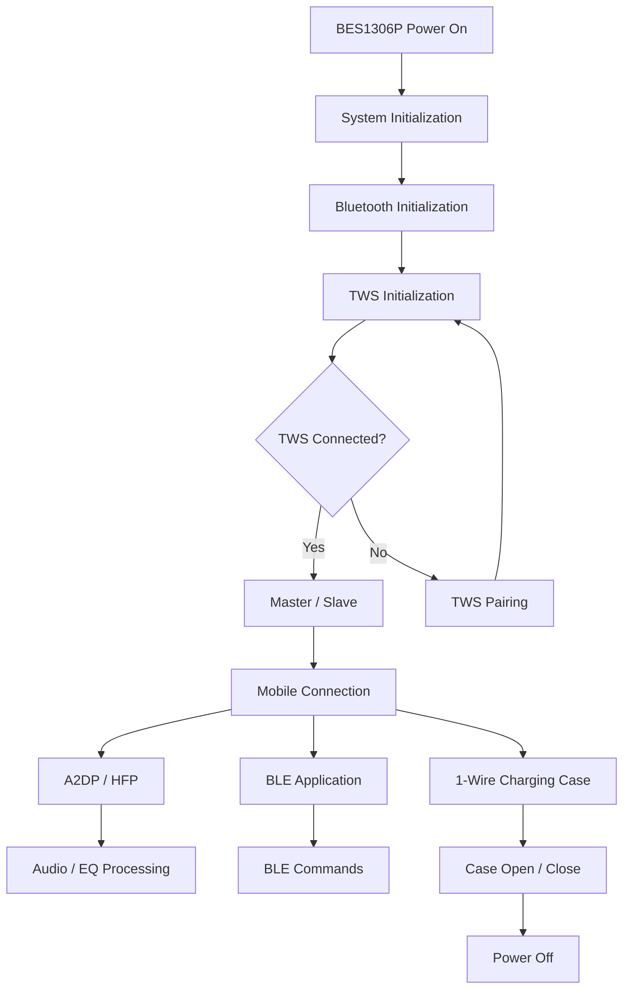

# NTT BES1306P TWS Firmware

```mermaid
flowchart TD
    A["BES1306P Power On"] --> B["System Initialization"]
    B --> C["Bluetooth Initialization"]
    C --> D["TWS Initialization"]

    D --> E{"TWS Connected?"}

    E -->|Yes| F["Master / Slave"]
    E -->|No| G["TWS Pairing"]

    F --> H["Mobile Connection"]
    G --> D

    H --> I["A2DP / HFP"]
    H --> J["BLE Application"]
    H --> K["1-Wire Charging Case"]

    I --> L["Audio / EQ Processing"]
    J --> M["BLE Commands"]
    K --> N["Case Open / Close"]

    N --> O["Power Off"]
```